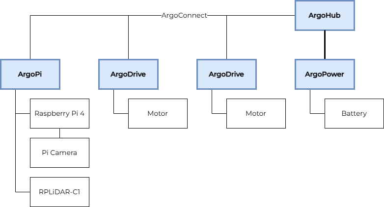

# ArgoBot 0

:::danger[WIP]
This document is still under construction! Thank you for your patience.
:::

ArgoBot 0 is the first robot in the Argo ecosystem. This is meant to be the minimum amount of hardware to have an ArgoBot. Leverages a differential drive to mitigate the amount of ArgoDrives necessary.

## Modules

- [ArgoPi](/docs/modules/ArgoPi)
    - [Raspberry Pi 4](https://www.raspberrypi.com/products/raspberry-pi-4-model-b/)
    - [Raspberry Pi Global Shutter Camera](https://www.raspberrypi.com/products/raspberry-pi-global-shutter-camera/)
    - [RPLiDAR C1](https://www.slamtec.ai/product/slamtec-rplidar-c1/)
- [ArgoDrive](/docs/modules/ArgoDrive) (2x)
- [ArgoHub](/docs/modules/ArgoHub)
- [ArgoPower](/docs/modules/ArgoPower)

